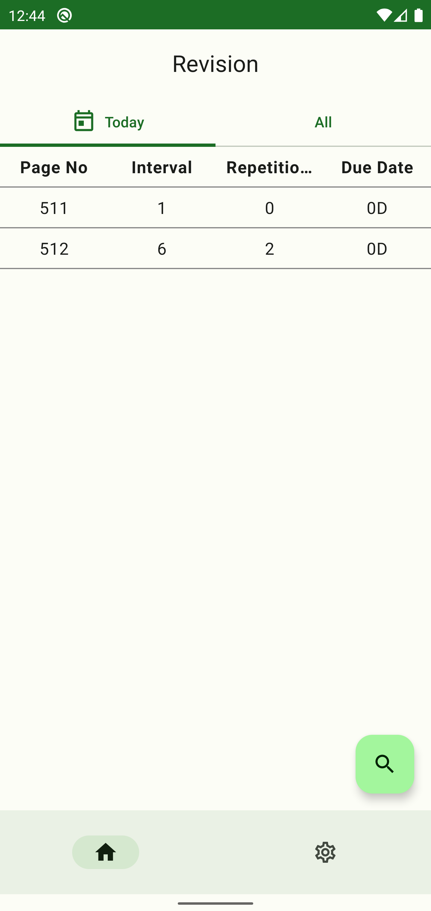
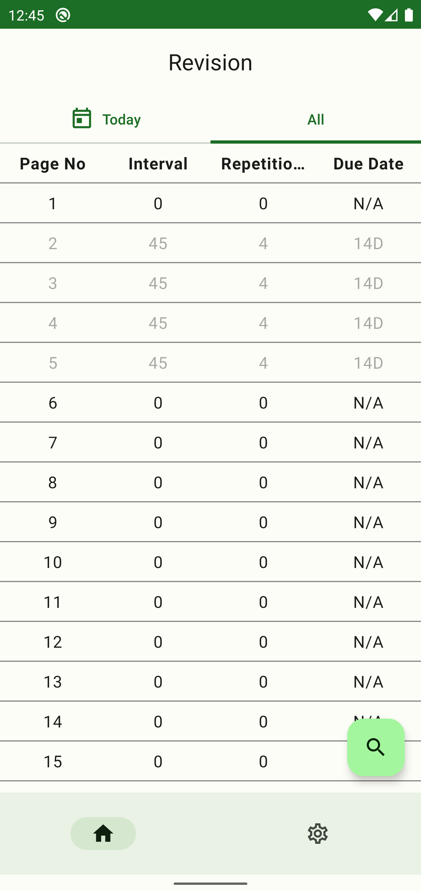
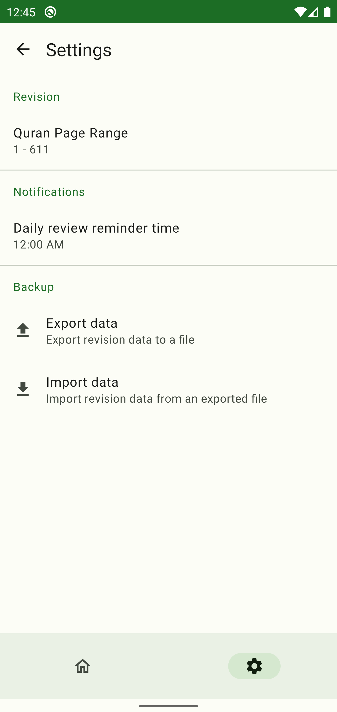
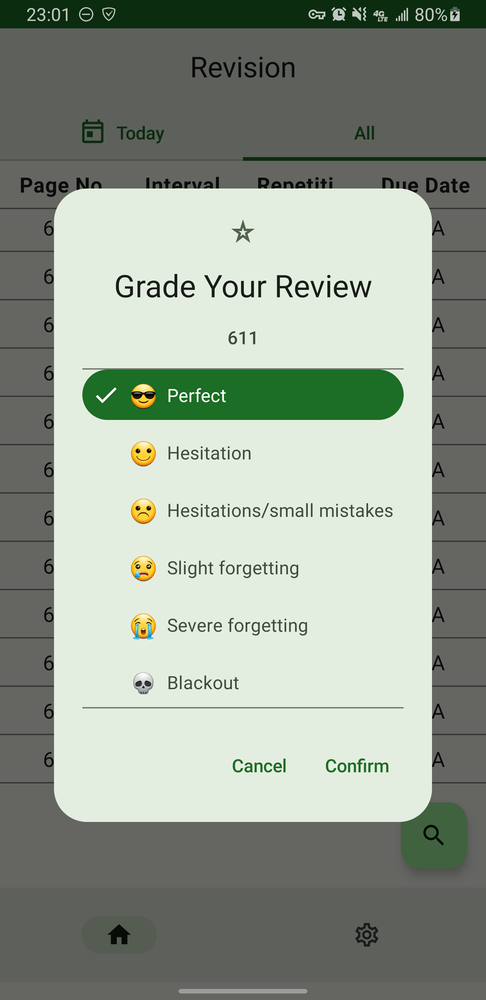

# Quran Spaced Repetition Multiplatform

iOS app and published Android app that utilizes spaced repetition to assist with retaining memorized pages from the Holy Quran

# Index

* [Why You Should Use](#why-you-should-use)
* [Links](#links)
* [App Overview](#app-overview)
    * [Features](#features)
    * [Screens](#screens)
        * [Home](#home-screen)
            * [Today Tab](#today-tab)
            * [All Tab](#all-tab)
        * [Settings](#settings-screen)
* [Tutorials](#tutorials)
    * [Reviewing Pages](#reviewing-pages)
* [Credits](#credits)

# Why You Should Use

* **Save time**: Unlike traditional methods of Quran review, which often involve reviewing a fixed
  amount of pages each time, this app saves time by reviewing only the pages that need to be
  reviewed at a given time, thereby increasing efficiency and maximizing retention.
* **Personalized review schedule**: This app uses the SuperMemo 2 spaced repetition algorithm to
  personalize your review schedule based on your memorization strength of each page, ensuring that
  you review each page of the Quran at optimal intervals to enhance long-term memorization.

# Links

[Google Play Store](https://play.google.com/store/apps/details?id=com.github.ahmad_hossain.quranspacedrepetition)

# App Overview

## Features

* Optimal Quran page review scheduling
* Daily Review Reminder Notification
* Backup Data (Export & Import)
* Dark Mode

## Screens

### Home Screen

This screen contains two sections, the "Today" Tab, and the "All" Tab.

#### Today Tab

This tab lists revision information far all Quran pages due for review 'today'.

To review a due page, click the page to open the page-grading-dialog, and select the appropriate
grade that represents your strength during your review. See [Reviewing Pages](#reviewing-pages) for
more details and guidance. Once a page has been reviewed, the app will be removed from the 'today'
tab.

**NOTE:** Ensure you always complete your due pages! Prioritize reviewing your due-pages over memorizing new pages to ensure your reviewed pages stay strong in your memory. There is no point in memorizing new pages if you are not going to retain all of them!!

#### All Tab

This tab lists revision information far all Quran pages, and is used for:

* Viewing your revision information for any Quran page.
* Grading a page that's been memorized for the first time.
  See [Reviewing Pages](#reviewing-pages) for guidance on memorizing, reviewing, and grading
  pages.

### Settings Screen

This screen allows you to configure various settings for the app.

* **Review Reminder Notification Timing**: Customize the timing for the daily review reminder
  notification.
* **Quran Page Range**: Customize the range of Quran pages shown in the app to match with your
  personal Quran.
* **Export Data**: Export your revision data to a file on your device.
* **Import Data**: Import your revision data from a previously exported file.

# Tutorials

## Reviewing Pages

1. The first step to marking a revision/initial-memorization is to recite the respective page
   from memory. \
   If you are doing a revision instead of an initial-memorization, ensure you do not
   look at the Quran page before your revision, unless it is to figure out the starting of the page.
   You should be reciting 100% from memory, otherwise this app will not be as effective.

2. Once you have recited the page from memory, you are ready to mark that in the app. Navigate to
   the correct Tab in the Home Screen, and click on the row for the respective page.

   Note: If you have just memorized a page for the 1st time, you will be doing this from the "All"
   Tab in the Home Screen. On the other hand, if you are reviewing a page that is due for review,
   you will be doing this from the "Today" Tab in the Home Screen.

3. After clicking the respective page, a Dialog will pop up with 6 options, each listing a grade
   that represents your memorization strength of the page during your review from Step 1. Select the
   appropriate grade that represents your memorization strength of the page during your review. This
   step is extremely important because the grade will determine the next time that the page will be
   scheduled for review.

   Grades are divided into 2 categories, and are as follows:

   **REMEMBERING** \
   😎: **Great**, excellent response \
   🙂: **Good**, correct response provided with some hesitation \
   ☹️: **Pass**, answer recalled with difficulty; perhaps, slightly incorrect

   **FORGETTING** \
   😢: **Fail**, wrong response that makes you say *I knew it!* \
   😭: **Bad**, wrong response; the correct answer seems to be familiar \
   💀: **Null**, complete blackout; you do not even recall ever knowing the answer. If you follow the
   review schedule that the app provides, you should rarely or never need this grade.

   **NOTE**: Ensure you understand the difference between **Pass** and **Fail**!
    * **Pass** and more means **remembering**!
    * **Fail** and less means **forgetting**!

   ###### Grade Explanation altered from [SuperMemo wiki](https://super-memory.com/help/learn.htm)

# Credits

This app uses the SuperMemo 2 spaced repetition algorithm:

Algorithm SM-2, (C) Copyright SuperMemo World, 1991. \
https://www.supermemo.com \
https://www.supermemo.eu
